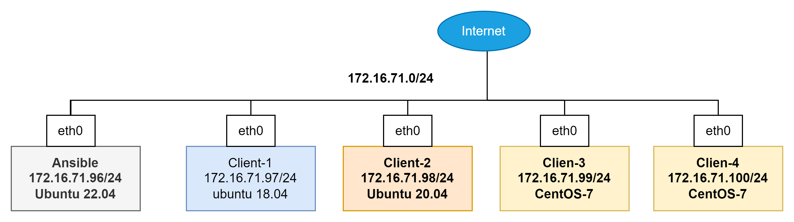

1.Các câu lệnh mà Ansible sử dụng cơ bản
```
#Kiểm tra trạng thái client
ansible [target host-group]-m ping

#Thực hiện lệnh đơn
ansible [target host-group]-m command -a "cmd_can_thuc_hien"
ansible [target host-group]-m command -a ""

#Kiểm tra distro của các host 
ansible [target host-group]-m setup -a 'filter=ansible_virtualization_type'
- a: để lọc kết quả
	- ansible_memory_mb
	- ansible_lvm
	- ansible_env
	- "ansible_default_ipv4"

#install package
ansible [target host-group]-m setup -a "name=[package] state=[version]"
## demo
ansible client3 -m apt -a "name=apache2 state=latest"
```


## 1. Mô hình LAB



## 2. IP Planning

| Hostname | OS | IP |
| --- | --- | --- |
| AnsibleServer | Ubuntu 22.04 | 172.16.71.96 |
| Client1 | CentOS7 | 172.16.71.97 |
| Client2 | Ubuntu 18.04 | 172.16.71.98 |
| Client3 | Ubuntu 20.04 | 1172.16.71.99 |
| Client4 | Centos7 | 172.16.71.100 |

Thực hiện add file host đối với các host.

```bash
cat << EOF > /etc/hosts
127.0.0.1 `hostname` localhost
172.16.71.97 client1
172.16.71.98 client2
172.16.71.99 client3
172.16.71.100 client4
EOF
```

## 3.Cài đặt

### 3.1 Cài đặt Ansible:

```bash
https://www.digitalocean.com/community/tutorials/how-to-install-and-configure-ansible-on-ubuntu-20-04
```

```bash
yum install -y epel-release 
yum update -y

yum install -y ansible
```

Kiểm tra version:

```bash
root@ansible:~# ansible --version
ansible [core 2.12.0]
  config file = /etc/ansible/ansible.cfg
  configured module search path = ['/root/.ansible/plugins/modules', '/usr/share/ansible/plugins/modules']
  ansible python module location = /usr/lib/python3/dist-packages/ansible
  ansible collection location = /root/.ansible/collections:/usr/share/ansible/collections
  executable location = /usr/bin/ansible
  python version = 3.10.6 (main, Nov 14 2022, 16:10:14) [GCC 11.3.0]
  jinja version = 3.0.3
  libyaml = True
```

### 3.2 Cài đặt Remote và khai báo file inventory

Ansible hoạt động theo cơ chế agentless, có nghĩa là không cần cài agent vào các máy client để điều khiển, thay vào đó ansible sẽ sử dụng việc điều khiển các client thông qua SSH. Do vậy, tới bước này ta có thể dùng 2 cách để ansible có thể điều khiển được các máy client.

- Cách 1: Sử dụng usename, port của ssh để khai báo trong inventory. Các này không được khuyến cáo khi dùng trong thực tế vì việc password dạng clear text sẽ hiện thị, hoặc nếu dùng cách này thì cần phải secure cho file inventory này bằng `ansible-vault`
- Cách 2: Sử dụng ssh keypair. Có nghĩa là ta sẽ tạo ra private key và public key trên node AnisbleServer và copy chúng sang các node client (hay còn gọi là các host).

### 3.3 Tạo SSH key cho các node

Thực hiện tại `Server Ansible` , sau đó copy key đến các máy client node, mục tiêu sử dụng để không phải nhập password của server mỗi lần đăng nhập vào các client.

Thực hiện

```bash
ssh-keygen
```

Kết quả:

```bash
Generating public/private rsa key pair.
Enter file in which to save the key (/root/.ssh/id_rsa):
Enter passphrase (empty for no passphrase):
Enter same passphrase again:
Your identification has been saved in /root/.ssh/id_rsa.
Your public key has been saved in /root/.ssh/id_rsa.pub.
The key fingerprint is:
SHA256:fjlkasjfkajsdklfjaslkfjklsadfsuFwbUCB6a0FDP4 root@ansible
The key's randomart image is:
+---[RSA 2048]----+
|X=o+...          |
|%@oo+.           |
|*=Oo.            |
|.B++.  o .       |
|+o=E..o S        |
|o..+..           |
|o ..+            |
|+oo.             |
|oo .             |
+----[SHA256]-----+
```

Thực hiện copy key sang node client:

```bash
ssh-copy-id root@IP
```

```bash
ssh-copy-id root@10.0.11.123
```

```bash
root@ansible:~# ssh-copy-id root@172.16.71.100
/usr/bin/ssh-copy-id: INFO: Source of key(s) to be installed: "/root/.ssh/id_rsa.pub"
/usr/bin/ssh-copy-id: INFO: attempting to log in with the new key(s), to filter out any that are already installed
/usr/bin/ssh-copy-id: INFO: 1 key(s) remain to be installed -- if you are prompted now it is to install the new keys
root@172.16.71.100's password: 

Number of key(s) added: 1

Now try logging into the machine, with:   "ssh 'root@172.16.71.100'"
and check to make sure that only the key(s) you wanted were added.
```

Nhập password của client khi màn hình yêu cầu nhập Password, Thực hiện với tất cả các host client.

### 3.4 Khai báo file Inventory

Thực hiện tại `Server Ansible`

Sao lưu lại file mẫu có sẵn:

```bash
mv /etc/ansible/hosts /etc/ansible/hosts.backup
```

Tạo file hosts mới:

```bash
nano /etc/ansible/hosts
```

```bash
# nano /etc/ansible/hosts
#khai bao host
[ubuntu]
172.16.71.97
172.16.71.98

[centos7]
172.16.71.99
172.16.71.100
```

Tên đặt trong thẻ `[Target-name]` ở đây được hiểu là gắn cho các host vào chung 1 nhóm (Có thể cùng một distro, cùng một chức năng, hoặc có cùng các thuộc tính để tiện setup về sau)

Kiểm tra tất cả các host client hiện đang được khai báo:

```bash
ansible all --list-hosts
```

```bash
#Result
root@ansible:~# ansible all --list-hosts
  hosts (4):
    172.16.71.97
    172.16.71.98
    172.16.71.99
    172.16.71.100
```

Nếu muốn hiển thị các host đang được nhóm lại với nhau:

```bash
ansible ubuntu --list-host
```

```bash
#result
root@ansible:~# ansible ubuntu --list-host
  hosts (2):
    172.16.71.97
    172.16.71.98
root@ansible:~# ansible centos7 --list-host
  hosts (2):
    172.16.71.99
    172.16.71.100
```

Trong thực tế cần khai báo thêm các tùy chọn về mật khẩu, port và user mà ansible được phép sử dụng để điều khiển host.

```bash
# nano /etc/ansible/hosts
[ubuntu]
client1 ansible_host=172.16.71.97 ansible_port=22 ansible_user=root
client2 ansible_host=172.16.71.98 ansible_port=22 ansible_user=root

[centos7]
client3 ansible_host=172.16.71.99 ansible_port=22 ansible_user=root
client4 ansible_host=172.16.71.100 ansible_port=22 ansible_user=root
```

- `client1, client2, client3, client4`: Tương ứng là các hostname của các node
- `ansible_host`: Địa chỉ IP của node client tương ứng
- `ansible_port`: Port của SSH phía client, nếu ta thay đổi thì sẽ chỉnh lại cho đúng.
- `ansible_user`: Là username của client mà AnsibleServer sẽ dùng để tương tác, trong bước trên tôi sử dụng là user `root` và thông qua SSH Key.

### 4. Sử dụng một số lệnh cơ bản

Cú pháp chung của ad-hoc command trong ansible là

```
ansible [pattern] -m [module] -a "[module options]"
```

Để kiểm tra việc khai báo sử dụng lệnh

```bash

```

Trả về kết quả như sau: 

```bash
#Cài đặt thành công
client3 | SUCCESS => {
    "ansible_facts": {
        "discovered_interpreter_python": "/usr/bin/python"
    },
    "changed": false,
    "ping": "pong"
}
client1 | SUCCESS => {
    "ansible_facts": {
        "discovered_interpreter_python": "/usr/bin/python3"
    },
    "changed": false,
    "ping": "pong"
}
```

Không thể SSH tới client, kiểm tra lại network.

```bash
client4 | UNREACHABLE! => {
    "changed": false,
    "msg": "Failed to connect to the host via ssh: ssh: connect to host 172.16.71.100 port 22: No route to host",
    "unreachable": true
}
```

Lỗi không thể SSH được tới server, Kiểm tra lại ssh-key:

```bash
client4 | UNREACHABLE! => {
    "changed": false,
    "msg": "Failed to connect to the host via ssh: Warning: Permanently added '172.16.71.100' (ED25519) to the list of known hosts.\r\nroot@172.16.71.100: Permission denied (publickey,gssapi-keyex,gssapi-with-mic,password).",
    "unreachable": true
}
```

Chú ý khi Ansible không thể liên lạc được với host thì kết quả trả về `"unreachable": true`

Ta cũng có thể áp dụng cho một group:

```bash
ansible centos7 -m ping
```

```bash
root@ansible:~# ansible centos7 -m ping
client3 | SUCCESS => {
    "ansible_facts": {
        "discovered_interpreter_python": "/usr/bin/python"
    },
    "changed": false,
    "ping": "pong"
}
client4 | SUCCESS => {
    "ansible_facts": {
        "discovered_interpreter_python": "/usr/bin/python"
    },
    "changed": false,
    "ping": "pong"
}
```

## 5. Sử dụng các module cơ bản để tương tác với các host

Được dùng để sử dụng các lệnh đơn, ngay sau khi thực hiện lệnh thì sẽ có output để quan sát. 

Đây là mực độ đầu tiên để sử dụng để kiểm tra hoặc thao tác kiểm tra giữa ansible và client đã đúng các config hay chưa.

### 5.1 Module Command

Ví dụ đối với các phiên bản linux dù cơ bản hay nâng cao trong đó có sử dụng các câu lệnh như: `ls -lah` , `free -m`, `uptime`, `uname -rms` …

Thực theo cú pháp

```bash
ansible all -m command -a "cau lenh can thuc thi"
```

> Tùy chọn `-a` dùng để truyền thêm các đầu vào cho module command.
> 

```bash
root@ansible:~# ansible centos7 -m command -a "uptime"
client4 | CHANGED | rc=0 >>
 16:20:48 up 19 min,  2 users,  load average: 0,00, 0,01, 0,01
client3 | CHANGED | rc=0 >>
 16:20:48 up 19:22,  2 users,  load average: 0,00, 0,01, 0,05

root@ansible:~# ansible all -m command -a "free -m"
client3 | CHANGED | rc=0 >>
              total        used        free      shared  buff/cache   available
Mem:           2764         123        2518           8         122        2457
Swap:          2047           0        2047
client4 | CHANGED | rc=0 >>
              total        used        free      shared  buff/cache   available
Mem:            486          74         325           4          86         394
Swap:          2047           0        2047
client2 | CHANGED | rc=0 >>
              total        used        free      shared  buff/cache   available
Mem:           3931         168        3411           0         351        3538
Swap:          3934           0        3934
client1 | CHANGED | rc=0 >>
              total        used        free      shared  buff/cache   available
Mem:            481          82         192           0         205         385
Swap:           961           0         961
```

Tạm hiểu rằng module `command` của ansible là cho phép ta dùng ansivle để thực thi các lệnh của linux.

### 5.2 Module Setup trong Ansible

Module `setup` để kiểm tra các thông tin tổng quát về hệ điều hành của các node, ví dụ kiểm tra thông tin card mạng, tên host, thông số về phần cứng …

Kiểm tra distro của các host 

```bash
ansible all -m setup -a 'filter=ansible_distribution'
```

```bash
root@ansible:~# ansible all -m setup -a 'filter=ansible_distribution'
client4 | SUCCESS => {
    "ansible_facts": {
        "ansible_distribution": "CentOS",
        "discovered_interpreter_python": "/usr/bin/python"
    },
    "changed": false
}
```

Một số các thông tin khác như:

- ansible_memory_mb: Check RAM
- ansible_lvm: LVM
- ansible_env: các biến môi trường trong Host
- ansible_default_ipv4: Địa chỉ IPv4 host

```bash
# RAM
root@ansible:~# ansible all -m setup -a 'filter=ansible_memory_mb'
client4 | SUCCESS => {
    "ansible_facts": {
        "ansible_memory_mb": {
            "nocache": {
                "free": 397,
                "used": 89
            },
            "real": {
                "free": 316,
                "total": 486,
                "used": 170
            },
            "swap": {
                "cached": 0,
                "free": 2047,
                "total": 2047,
                "used": 0
            }
        },
        "discovered_interpreter_python": "/usr/bin/python"
    },
    "changed": false
}
```

```bash
#Check IPv4
root@ansible:~# ansible all -m setup -a 'filter=ansible_default_ipv4'
client4 | SUCCESS => {
    "ansible_facts": {
        "ansible_default_ipv4": {
            "address": "172.16.71.100",
            "alias": "eth0",
            "broadcast": "172.16.71.255",
            "gateway": "172.16.71.1",
            "interface": "eth0",
            "macaddress": "52:54:00:72:9b:0a",
            "mtu": 1500,
            "netmask": "255.255.255.0",
            "network": "172.16.71.0",
            "type": "ether"
        },
        "discovered_interpreter_python": "/usr/bin/python"
    },
    "changed": false
}
```