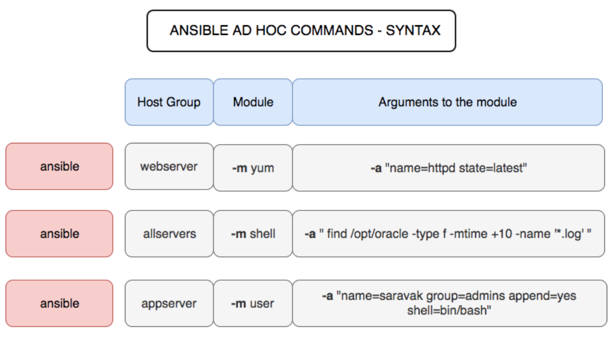

# ad-hoc

# Cú pháp sử dụng ad-hoc command



Để ad-hoc có thể chạy được, câu lệnh phải có khung hoặc cú pháp như sau:

```bash

ansible <host-pattern> [options]

```

Hoặc

```bash
ansible host-remote -m <modulename> -a <tham so module>
```

# Điều kiện tiên quyết

1. Ansible phải được cài đặt
2. Đã tạo ssh-based giữa ansible server và các client.

## Thực hành với Ansible ad-hoc#

### Thực hiện lệnh đơn

```bash

ansible [target host-group]-m command -a "cmd_can_thuc_hien"
ansible [target host-group]-m command -a ""

```

### Kiểm tra distro của các host

```bash
ansible [target host-group]-m setup -a 'filter=ansible_virtualization_type'

```

- `a`: để lọc kết quả
	- ansible_memory_mb
	- ansible_lvm
	- ansible_env
	- "ansible_default_ipv4"

### install package

```bash
ansible [target host-group]-m setup -a "name=[package] state=[version]"

```

```bash
## demo
ansible client3 -m apt -a "name=apache2 state=latest"
```

### ping trong ad-hoc

Trong ví dụ này, kiểm tra các nút hoặc máy chủ từ xa và đảm bảo rằng chúng phản hồi lại bằng kênh SSH mặc định của Ansible

```bash
root@ansible:~# ansible all -m ping
client3 | SUCCESS => {
    "ansible_facts": {
        "discovered_interpreter_python": "/usr/bin/python"
    },
    "changed": false,
    "ping": "pong"
}
client4 | SUCCESS => {
    "ansible_facts": {
        "discovered_interpreter_python": "/usr/bin/python"
    },
    "changed": false,
    "ping": "pong"
}
...
root@ansible:~# ansible client1 -m ping
client1 | SUCCESS => {
    "ansible_facts": {
        "discovered_interpreter_python": "/usr/bin/python3"
    },
    "changed": false,
```

### Kiểm tra thời gian hoạt động

Kiểm tra thời gian hoạt động của máy chủ. Ansible cung cấp hai mô-đun chính để chạy lệnh trên nhóm máy chủ hoặc trên máy chủ từ xa.

```bash
root@ansible:~# ansible client1 -m command -a uptime
client1 | CHANGED | rc=0 >>
 14:00:50 up 2 days, 22:54,  1 user,  load average: 0.00, 0.00, 0.00
root@ansible:~# ansible client1 -m shell -a uptime
client1 | CHANGED | rc=0 >>
 14:01:01 up 2 days, 22:54,  1 user,  load average: 0.08, 0.02, 0.01
root@ansible:~# ansible client1 -a uptime
client1 | CHANGED | rc=0 >>
 14:01:21 up 2 days, 22:55,  1 user,  load average: 0.06, 0.01, 0.00
```

`-m` là mô-đun và `-a` nên chứa lệnh mà nó sẽ chạy dưới dạng đối số cho lệnh và shell.

### Kiểm tra việc sử dụng bộ nhớ

Lệnh ansible ad-hoc sau đây sẽ giúp bạn có được bộ nhớ trống của tất cả các máy chủ trong nhóm máy chủ có tên mà bạn muốn kiểm tra

Như bạn có thể thấy, chúng tôi đang chạy lệnh `free -m` trên các máy chủ từ xa và thu thập thông tin

```bash
root@ansible:~# ansible client1 -a "free -m"
client1 | CHANGED | rc=0 >>
              total        used        free      shared  buff/cache   available
Mem:            481          89         108           0         282         378
Swap:           961           4         957
```

### Kiểm tra bộ nhớ

```bash
root@ansible:~# ansible client1 -a "lsblk"
client1 | CHANGED | rc=0 >>
NAME                      MAJ:MIN RM  SIZE RO TYPE MOUNTPOINT
sr0                        11:0    1  945M  0 rom
vda                       252:0    0   20G  0 disk
├─vda1                    252:1    0    1M  0 part
├─vda2                    252:2    0    1G  0 part /boot
└─vda3                    252:3    0   19G  0 part
  └─ubuntu--vg-ubuntu--lv 253:0    0   19G  0 lvm  /
```

### Thực thi lệnh với tư cách người dùng root (sudo) trên máy chủ bằng lệnh ad hoc ansible

### Thực thi lệnh với tư cách người dùng khác  (sudo su)

### Tạo nhóm người dùng unix - `user gruop`

Ở đây chúng tôi đang tạo một nhóm tên người dùng có tên user1 bằng cách sử dụng mô-đun group ansible, tác vụ tương tự có thể được đảo ngược để xóa nhóm nếu bạn thay đổi từ `state` sang `absent`

```bash
ansible client1 -m group -a "name=kt state=present"
```

Check group bên phía client

```bash
getent group | grep kt
```

```bash
#del group
ansible client1 -m group -a "name=group-name state=absent"
```

### Tạo người dùng unix

```bash
ansible client1 -m user -a "name=huydemo group=kt createhome=yes" -b
```

```bash
#remove user
ansible client1 -m user -a "name=huydemo state=absent" -b
```

check user trên client1

```bash
cat /etc/passwd | grep huydemo
```

### Tạo một thư mục với quyền 755 – mkdir ansible

Sử dụng module `file`

```bash
ansible client1 -m file -a "path=/opt/test state=directory mode=0755" -b
```

### Tạo tệp có quyền 755

```bash
ansible client1 -m file -a "path=/opt/test/testfile state=touch mode=0755"
```

### Thay đổi quyền sở hữu tệp

```bash
ansible client1 -m file -a "path=/opt/test/testfile group=kt owner=huydemo " -b
```

### Kiểm tra dung lượng đĩa trống của máy chủ

Hầu hết chúng ta đều muốn nhanh chóng kiểm tra dung lượng đĩa của nhiều máy bằng một lệnh duy nhất. đây là lệnh đó

```bash
ansible multi -a "df -h"

```

```bash
##result
root@ansible:~# ansible client1 -a "df -h"
client1 | CHANGED | rc=0 >>
Filesystem                         Size  Used Avail Use% Mounted on
udev                               209M     0  209M   0% /dev
tmpfs                               49M  676K   48M   2% /run
/dev/mapper/ubuntu--vg-ubuntu--lv   19G  3.1G   15G  18% /
tmpfs                              241M     0  241M   0% /dev/shm
tmpfs                              5.0M     0  5.0M   0% /run/lock
tmpfs                              241M     0  241M   0% /sys/fs/cgroup
/dev/vda2                          974M   78M  829M   9% /boot
tmpfs                               49M     0   49M   0% /run/user/0
```

### Cài đặt gói bằng lệnh yum

Cách cài đặt gói hoặc phần mềm trong linux bằng mô-đun `yum` của ansible

```bash
#centos7
ansible client3 -m yum -a "name=httpd state=installed"
```

```bash
#Ubuntu
ansible client1 -m apt -a "name=apache2  state=latest"
```

### Bắt đầu hoặc dừng dịch vụ

```bash
#start
ansible client3 -m service -a "name=httpd state=started enabled=yes"
```

```bash
#stop
ansible clien3 -m service -a "name=httpd state=stoped enabled=yes"
```

### Cài đặt và định cấu hình máy chủ ứng dụng python Django với ansible ad-hoc

```bash
$ ansible app -s -m yum -a "name=MySQL-python state=present"

$ ansible app -s -m yum -a "name=python-setuptools state=present"

$ ansible app -s -m easy_install -a "name=django"
```

### Quản lý Cron Job và lập lịch với Ansible ad-hoc

Dễ dàng quản lý các công việc Cron với mô-đun cron Ansible. Dưới đây là các lệnh danh sách bạn có thể giữ tiện dụng

```bash
#Chạy công việc cứ sau 15 phút
ansible client3 -s -m cron -a "name='daily-cron-all-servers' minute=*/15 
job='/path/to/minute-script.sh'"
```

```bash
#Chạy công việc bốn giờ một lần
ansible client3 -s -m cron -a "name='daily-cron-all-servers' hour=4 
job='/path/to/hour-script.sh'"

```

```bash
#Kích hoạt một Công việc để chạy khi khởi động lại hệ thống
ansible client3 -s -m cron -a "name='daily-cron-all-servers' special_time=reboot 
job='/path/to/startup-script.sh'"

```

```bash
#Lập kế hoạch công việc hàng ngày
ansible client3 -s -m cron -a "name='daily-cron-all-servers' special_time=daily 
job='/path/to/daily-script.sh'"

```

```bash
#Lập kế hoạch công việc hàng tuần
ansible client3 -s -m cron -a "name='daily-cron-all-servers' special_time=weekly 
job='/path/to/daily-script.sh'"
```

### Chạy các hoạt động trong nền không đồng bộ với Polling ansible

### Khởi động lại hệ thống từ xa

### Kiểm tra trạng thái dịch vụ

```bash
ansible client3 -m service -a "name=httpd"
```

```bash
client3 | SUCCESS => {
    "ansible_facts": {
        "discovered_interpreter_python": "/usr/bin/python"
    },
    "changed": false,
    "name": "httpd",
    "status": {
.....................
        "ActiveState": "active",
.....................
```

### Sao chép tệp cục bộ sang điều khiển từ xa

Câu lệnh sau thực hiện copy tệp tử `src` địa chỉ file tại máy ansible đến `dest` địa chỉ file máy nhận file, và phân quyền user và group là apache, có quyền là `0644`

```bash
ansible client3 -m copy -a "src=[source file]  dest=[dest file] owner=[name user] group=[name group] mode=xxx"
```

```bash
ansible client3 -m copy -a "src=/root/file1.txt dest=/root/ owner=apache group=apache mode=0644"
```

Thực hiện với thu mục tương tự

### Liệt kê các liên kết NFS - Mount

```bash
ansible client3 -m shell -a 'df -h -T|grep -i nfs' -i /etc/ansible/hosts
```

### Thu thập phân phối bộ nhớ, cpu và hệ điều hành của máy chủ

```bash
ansible host -m setup -i  inventory_file -a 'filter=ansible_distribution,ansible_distribution_version,ansible_memfree_mb,ansible_memtotal_mb,ansible_processor_cores*,ansible_architecture' 2>/dev/null

```

```bash
root@ansible:~# ansible client3 -m setup -i  /etc/ansible/hosts -a 'filter=ansible_distribution,ansible_distribution_version,ansible_memfree_mb,ansible_memtotal_mb,ansible_processor_cores*,ansible_architecture' 2>/dev/null
client3 | SUCCESS => {
    "ansible_facts": {
        "ansible_architecture": "x86_64",
        "ansible_distribution": "CentOS",
        "ansible_distribution_version": "7.9",
        "ansible_memfree_mb": 2281,
        "ansible_memtotal_mb": 2764,
        "ansible_processor_cores": 1,
        "discovered_interpreter_python": "/usr/bin/python"
    },
    "changed": false
}
```

### Dừng, bắt đầu, khởi động lại, tải lại dịch vụ

```bash
ansible client3 -m shell -a "systemctl stop httpd" -b

```

```bash
ansible Client3 -m shell -a "systemctl restart httpd" -b
```

### Lệnh đặc biệt để tải xuống tệp từ URL - Wget

Để tải xuống một tệp từ URL trong quảng cáo đặc biệt ansible. Bạn có thể gọi các lệnh linux như `CURL` hoặc `WGET` nhưng cách tốt nhất là sử dụng mô-đun `get_url` của Ansible.

Đây là cách bạn có thể sử dụng mô-đun `get_url` trong Ansible ad hoc để tải xuống một tệp trong hệ thống từ xa

```bash
ansible client3 -m get_url -a "url=https://nodejs.org/dist/v14.17.4/node-v14.17.4-linux-x64.tar.xz dest=/tmp mode=0755" -i /etc/ansible/hosts
```

- `dest` : Thư mục đích mà tệp sẽ được tải xuống
- `url`: Từ nơi tập tin sẽ được lấy
- `mode`: Chế độ cấp phép tệp của tệp sau khi tải xuống. chúng tôi đang thiết lập 755

### Lệnh adhoc để kiểm tra các cổng listen

```bash
ansible name-host -m listen_ports_facts -i /etc/ansible/hosts
```

### Kiểm tra vị trí của package đã cài

```bash
ansible target_servers -m shell -a "which tar; which wget; which unzip;"
```

[cmd ansible](https://www.notion.so/cmd-ansible-71daa273a2ad401e94c7f4215d84288a)