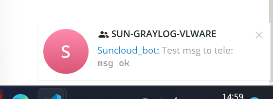
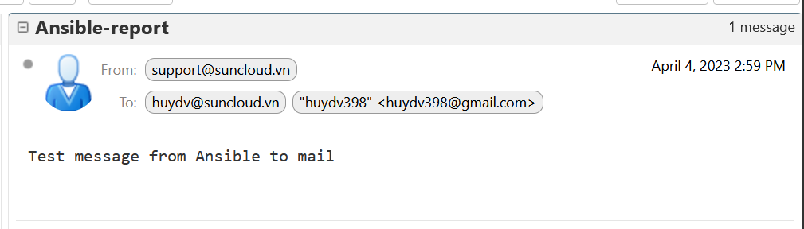
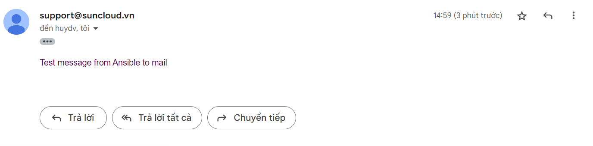

# Send mail-tele

# Thực hiện gửi thông điệp bằng Ansible qua Email và Telegram

## Email

Thực hiện cài đặt bắt buộc để sử dụng module `community.general.mail module`

```bash

ansible-galaxy collection install community.general
```

Tạo role:

```bash

# ~/vmware
cd ~/vmware
ansible-galaxy init --force --offline send-alear
```

Khai báo Thông tin cho SMTP server và Tele

```bash
cd ~/vmware
```

```markdown
cat << EOF > inventory/group_vars/all/05-notify.yml

---
api_token: 5575898315:AAHJuZqnb678LndGCGSPbDFP9py5ZKd70O0
chat_ID: -970237435

mail_host: mail.suncloud.vn
mail_port: 587
mail_username: support@suncloud.vn
mail_password: 7bpmYRyDrsibpaV
EOF
 
```

Tạo task cho mail và tele

```bash
---
# tasks file for send-alear

#task for mail
- name: Sending an e-mail using Gmail SMTP servers
  community.general.mail:
    host: "{{ mail_host }}"
    from: "{{ mail_username }}"
    port: "{{ mail_port }}"
    username: "{{ mail_username }}"
    password: "{{ mail_password }}"
    to: "{{ user_to }}"
    subject: Ansible-report
    body: Test message from Ansible
  delegate_to: localhost

#task for tele
- name: Send notify to Telegram
  community.general.telegram:
    token: "{{ api_token }}"
    api_args:
      chat_id: "{{ chat_ID }}"
      parse_mode: "markdown"
      text: "Test msg to tele: `msg ok`"
      disable_web_page_preview: true
      disable_notification: true
```

file dùng để chạy role:

```bash
---
- hosts: localhost
  become: no
  gather_facts: False
  vars:
    user_to: #khai báo các địa chi cần gửi thông tin đến
      - huydv@suncloud.vn
      - huydv398@gmail.com
  roles:
  - send-alear
```

Sau khi sau báo ta được các nội dung như sau:

```bash
root@ansible:~/Ansible-note/vmware# tree .
.
├── ansible.cfg
├── inventory
│   ├── group_vars
│   │   └── all
│   │       └── 05-notify.yml ##KHAI BÁO var TELE-MAIL.
│   └── hosts
├── lab-vmware.yml # Play role
├── README.md
├── requirements.txt 
└── roles
   └── send-alear
      └── tasks
          └── main.yml # dùng để khai báo các play ở đây

```

Thực hiện được kết quả như sau:

```bash
root@ansible:~/vmware# ansible-playbook lab-vmware.yml
```

```bash
root@ansible:~/Ansible-note/vmware# ansible-playbook lab-vmware.yml

PLAY [localhost] ******************************************************************************************************************************************************************

TASK [send-alear : msg] ***********************************************************************************************************************************************************
ok: [localhost] => 
  msg: mail.suncloud.vn

TASK [send-alear : Sending an e-mail using Gmail SMTP servers] ********************************************************************************************************************
ok: [localhost]

TASK [send-alear : Send notify to Telegram] ***************************************************************************************************************************************
changed: [localhost]

PLAY RECAP ************************************************************************************************************************************************************************
localhost                  : ok=3    changed=1    unreachable=0    failed=0    skipped=0    rescued=0    ignored=0
```

Thông báo từ tele



Thông báo từ mail



